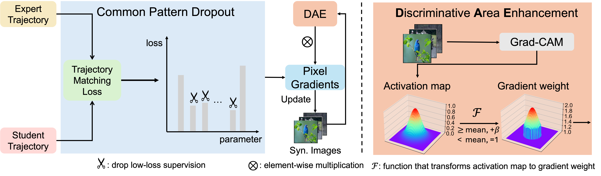
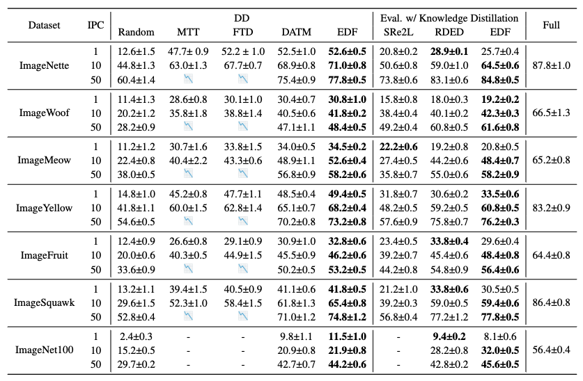
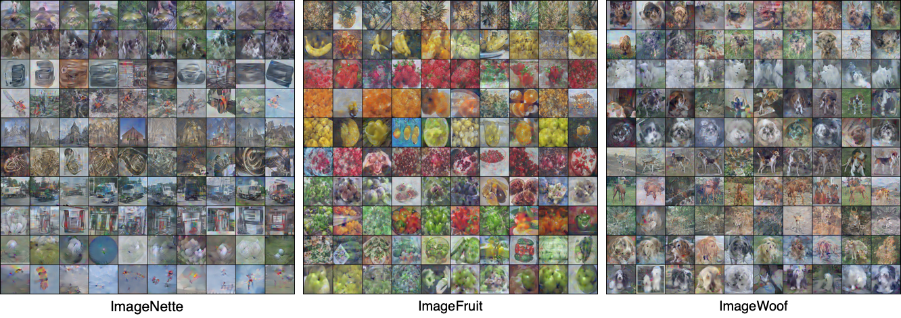

# Emphasizing Discriminative Features for Dataset Distillation in Complex Scenarios

## [Project Page]() | [Paper](http://arxiv.org/abs/2410.17193)

> Kai Wang\*, Zekai Li\*, Zhi-Qi Cheng, Samir Khaki, Ahmad Sajedi, Ramakrishna Vedantam, Konstantinos N Plataniotis, Alexander Hauptmann, Yang You
>
> National University of Singapore, Carnegie Mellon University, University of Toronto, Independent Researcher
>
> *equal contribution

## Introduction



In this work, we propose to emphasize discriminative features for dataset distillation in the complex scenario, i.e. images in complex scenarios are characterized by significant variations in object sizes and the presence of a large amount of class-irrelevant information.

EDF achieves this from supervision and data perspectives via a *Common Pattern Dropout* and a *Discriminative Area Enhancement* module, respectively:

- **Common Pattern Dropout**: We drop low-loss suerpvision as it contains mainly common patterns and weakens the discriminative feature representation.
- **Discriminative Area Enhancement**: We use Grad-CAM activation maps to create pixel gradients which serve as guidance of distillation. As a result, high-activation areas receive more updates.

## Peformance



EDF demonstrates prominent peroformances on several ImageNet-1K subsets compared with various baselines. 

## Visualization of Synthetic Images



## Comp-DD Benchmark

Please navigate to [comp-dd](https://github.com/NUS-HPC-AI-Lab/EDF/tree/main/comp-dd)

## Getting Started

Create environment as follows:

```bash
conda env create -f environment.yaml
conda activate dd
```

## Train Expert Trajectories

To train expert trajectories, you can run

```bash
bash scripts/buffer.sh
```

In the script, we demo with the "ImageNette" subset.  Change the argument `--subset` to other subsets when training expert trajectories on them.

For the list of available subsets, please refer to `utils/utils_gsam`.

## Distill

To perform distillation, please run:

```bash
bash scripts/distill_in1k_ipc1.sh # for ipc1
bash scripts/distill_in1k_ipc1.sh # for ipc10
bash scripts/distill_in1k_ipc1.sh # for ipc50
```

Similarly, the sample scripts provided use "ImageNette" for demo. You can change the subset easily as follows:

```bash
cd distill
CFG="../configs/ImageNet/SUBSET/ConvIN/IPC1.yaml" # replace the SUBSET with the one you want to distill
python3 edf_distill.py --cfg $CFG
```

Hyper-parameters in each config file in `configs` are the ones used in EDF main experiments. Feel free to play around with other hyper-parameters for distillation by modifying the corresponding config file.

## Evaluation

By default, we perform evaluation along after every 500/1000 iterations. If you want to evaluate distilled explicitly, you can run

```bash
cd distill
python3 evaluation.py --lr_dir=path_to_lr --data_dir=path_to_images --label_dir=path_to_labels
```

In our paper, we also use knowledge distillation to ensure a fair comparison against methods that integrate knowledge distillation during evaluation. For detailed implementation, please refer to the official codebase of [SRe2L](https://github.com/VILA-Lab/SRe2L.git) and [RDED](https://github.com/LINs-lab/RDED.git).

## Acknowledgement

Our code is built on [PAD](https://github.com/NUS-HPC-AI-Lab/PAD)
