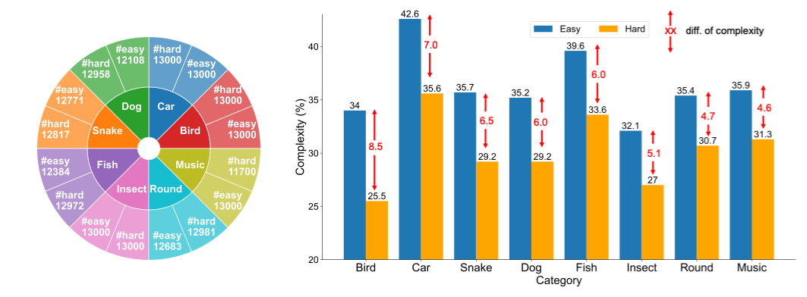

# Complex Dataset Distillation Benchmark

We introduce the **Comp**lex **D**ataset **D**istillation (Comp-DD) benchmark, which is constructed by selecting subsets from ImageNet-1K based on their complexity. This benchmark represents an early and pioneering effort to address dataset distillation in complex scenarios.

Although there are numerous benchmarks for simpler tasks, there is a notable absence of benchmarks designed specifically for complex scenarios. This gap presents a significant challenge to advancing research in this area and limits the practical application of dataset distillation. To bridge this gap, we propose the first dataset distillation benchmark explicitly built around scenario complexity, aiming to promote further exploration within the DD community.

## How to Build

We breiefly describe how to construct Comp-DD as follows. For more details, please refer the Section 3 of our paper.

1. **Evaluate complexity**: We first use our complexity metrics to evaluate all classes of ImageNet-1K. We use the percentage of pixels with activation values above a predefined threshold (set to 0.5 in our case) to measure the complexity. The larger the value, the lower the complexity. Formally, the complexity of an image if defined as $$1-\frac{\sum_{h}\sum_{w} \mathbb{I}[M^{i}_{h,w} \geq 0.5]}{H \cdot W} \nonumber$$
   Then, the complexity of each class is then determined by averaging the complexity scores across all images within that class.

2. **Identify categories**: In Comp-DD, we define a category as a collection of classes describing visually similar objects or animals of the same species. The purpose is to diminish the class differences.

3. **Select subsets**: Within each category, we select ten classes with the highest complexity as the "hard" subset, and ten classes with the lowest complexity as the "easy" subset.

## Statistics



We carefully selected eight categories from ImageNet-1K: Bird, Car, Dog, Fish, Snake, Insect, Round, and Music. In total, there are 16 subsets each with 10 classes.

The diagram on the left summarizes the number of training images in each subset, while all subsets contain 500 images in the validation set. 

The diagram on the right illustrates the difference between easy and hard subsets. As expected, the hard subsets display significantly higher complexity than the easy subsets.

## How to Use

We provide fundemental ways to load data, perform distillation, and evaluate.

### Load Data

We provide an interface to load any subset of Comp-DD in `comp-dd/load_data`.  A sample usage is provided below:

```python
data_path = "/path/to/imagenet" 
category = "bird" # must be one of ['bird', 'dog', 'car', 'fish', 'insect', 'snake', 'round', 'music']
subset = "easy" # must be easy or hard
im_size = (128, 128) # by default, we use resolution 128x128
batch_size = 256

channel, im_size, num_classes, dst_train, dst_test, class_map, class_map_inv = load_comp_dd(data_path, category, subset, im_size, batch_size)

image, label = dst_train[0]
```

Explanation of return values:

- `channel`: The number of channles of an image. By default is 3, referring to R, G, B.
- `im_size`: The size of an image. By default is 128x128.
- `num_classes`: The number of classes of the loaded subset. In Comp-DD, we use 10-class subsets.
- `dst_train`: The train dataset. Each element of the dataset is a tuple of an image and its label.
- `dst_test`: The test dataset.
- `class_map`: The mapping from original ImageNet-1K class indices to `[0, num_classes-1]` for each class in the subset.
- `class_map_inv`: The reverse class index mapping.

### Evaluation

After you obatin distilled datasets with your method, you can use our evaluation script to evaluate the performance by running the follow:

```bash
python3 eval.py 
--data_path /path/to/imagenet --data_dir /path/to/syn_images --label_dir /path/to/syn_labels --lr_dir /path/to/syn_lr 
--category bird --subset "easy"
--model ConvNetD5 --lr_net 1e-2
```

We implement the evaluation with differentiable Siamese augmentation. You can disable the augmentation by setting `--dsa False`. 

We do not use knowledge distillation strategy to evaluate the synthetic data. Specifically, the student model is trained by minimizing the Cross-Entropy loss between output logits and labels. 

Moreover, we implement the soft Cross-Entropy loss to cope with soft labels as follows:

```python
def SoftCrossEntropy(inputs, target):
    input_log_likelihood = -torch.nn.functional.log_softmax(inputs, dim=1)
    target_log_likelihood = torch.nn.functional.softmax(target, dim=1)
    batch = inputs.shape[0]
    loss = torch.sum(torch.mul(input_log_likelihood, target_log_likelihood)) / batch
    return loss
```

